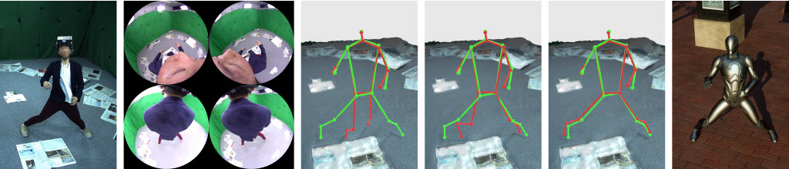

# EgoRear (ICCV 2025)
The official implementation of our ICCV 2025 paper, "Bring Your Rear Cameras for Egocentric 3D Human Pose Estimation".



**For any questions, please contact the first author, Hiroyasu Akada [hakada@mpi-inf.mpg.de] .**

[[Project Page]](https://4dqv.mpi-inf.mpg.de/EgoRear/) [[Paper]](https://arxiv.org/abs/2503.11652)


# Citation

```
@inproceedings{hakada2025egorear,
  title = {Bring Your Rear Cameras for Egocentric 3D Human Pose Estimation},
  author = {Akada, Hiroyasu and Wang, Jian and Golyanik, Vladislav and Theobalt, Christian},
  booktitle = {International Conference on Computer Vision (ICCV)}
  year = {2025},
}
```


# Updates

- 27/07/2025: Initial release.


# Datasets

## Ego4View-Syn

For now, you can manually download the **Ego4View-Syn** dataset (~450GB) on [Edmond](https://edmond.mpg.de/dataset.xhtml?persistentId=doi:10.17617/3.TUS70H).

Please unzip and organize the downloaded data as follows.

(We will also provide the download script that automates this process soon.)

```
Ego4View_syn
├── test.txt
├── train.txt
├── validation.txt
├── Character Name 1 (e.g., rp_aaron_posed_002)
│   ├── Sequence ID 1 (e.g., 1001)
│   │   ├── fisheye_rgb
│   │	└── json_smplx_gendered
│   │
│   ├── Sequence ID 2
│   ├── Sequence ID 3
│   └──...
│
├── Character Name 2
├── Character Name 3
└──...
```


We provide metadata for each frame:

- **fisheye_rgb**: rgb images, jpeg, 872 × 872
- **json_smplx_gendered**:
    - global_trans_blender: translations (in meters) of the device and cameras in the Blender global coordinate system
    - global_rot_blender: rotations (in radians) in the Blender global coordinate system
    - smplx_params: SMPL-X parameters (gendered version)
    - joints:
        - trans_blender: translations (in meters) of joints in the Blender global coordinate system
        - device_pts3d: device-relative 3D joint locations (in centimeters) in the OpenCV coordinate system
        - camera_front/back_left/right_pts3d: camera-relative 3D joint locations (in centimeters) in the OpenCV coordinate system
        - camera_front/back_left/right_pts2d: 2D joint pixel locations in the image coordinate system

Our camera calibration file is also available [here](https://github.com/hiroyasuakada/EgoRear/tree/main/pose_estimation/utils/camera_calib_file/ego4view).


## Ego4View-RW

For now, you can manually download the **Ego4View-RW** dataset (~640GB) on [Edmond](https://edmond.mpg.de/dataset.xhtml?persistentId=doi:10.17617/3.D9QKEH).

Please unzip and organize the downloaded data as follows.

(We will also provide the download script that automates this process soon.)

```
Ego4View_rw
├── test.txt
├── train.txt
├── validation.txt
├── Date 1 (e.g., 2024_07_24)
│   ├── Subject ID (e.g., S1)
│   │   ├── Sequence ID (e.g., seq_3-0)
│   │   │  ├── fisheye_rgb
│   │	│  └── json_smplx
│   │	│
│   │   ├── Sequence ID 2
│   │	├── Sequence ID 3
│   │   └──...
│   │
│   ├── Subject ID 2
│   ├── Subject ID 3
│   └──...
│
├── Date 2
├── Date 3
└──...
```

We provide metadata for each frame:

- **fisheye_rgb**: rgb images, jpeg, 872 × 872
- **json_smplx**:
    - calib_board_pose: transformation matrix (in meters) of the calibration board attached to the HMD device in the Blender global coordinate system
    - camera_pose: transformation matrix (in meters) of the cameras attached to the HMD device in the Blender global coordinate system
    - global_rot_blender: rotations (in radians) in the Blender global coordinate system
    - smplx_params_gendered/neutral: SMPL-X parameters compatible with [EasyMocap](https://github.com/zju3dv/EasyMocap)
    - joints:
        - trans: translations (in centimeters) of joints in the Blender global coordinate system
        - device_pts3d: device-relative 3D joint locations (in centimeters) in the OpenCV coordinate system
        - camera_front/back_left/right_pts3d: camera-relative 3D joint locations (in centimeters) in the OpenCV coordinate system
        - camera_front/back_left/right_pts2d: 2D joint pixel locations in the image coordinate system

Our camera calibration file is also available [here](https://github.com/hiroyasuakada/EgoRear/tree/main/pose_estimation/utils/camera_calib_file/ego4view).


# Implementation for Egocentric 3D Pose Estimation

## Dependencies

      conda create -n ego4view python=3.10 -y
      source activate ego4view

      conda install nvidia/label/cuda-12.1.0::cuda-tools
      pip3 install torch==2.4.0 torchvision==0.19.0 torchaudio==2.4.0 --index-url https://download.pytorch.org/whl/cu121
      pip3 install lightning natsort loguru open3d opencv-python pillow numpy scipy einops timm
      pip3 install mmcv==2.2.0 -f https://download.openmmlab.com/mmcv/dist/cu121/torch2.4/index.html
      pip3 install -U 'jsonargparse[signatures]>=4.27.7'


## Preprocessing

You can generate 2D joint heatmaps as NPY files for faster data loading with the following commands.

      # Ego4View-Syn
      python generate_heatmap.py --data_dir_path [path to Ego4View_syn] --dataset_type syn

      # Ego4View-RW
      python generate_heatmap.py --data_dir_path [path to Ego4View_rw] --dataset_type rw

If you don't have enough free space and can't generate NPY files, you can alternatively modify the logic in the dataloaders with the `generate_target` function in the `generate_heatmap.py` to pass ground truths of 2D joint heatmaps to the models.

## Training

You can train the models from scratch or use [trained weights](https://drive.google.com/drive/folders/1QapWD5wjowt8Z7R6gopYMR70_mkCV_As?usp=drive_link). The model weights and training logs will be saved in `./log/(experiment_name)`.


### 4-view Experiments

- Training 2D Joint Heatmap Estimator

      # Ego4View-Syn
      python run.py fit --config ./configs/ego4view_syn_heatmap_stereo_front.yaml
      python run.py fit --config ./configs/ego4view_syn_heatmap_stereo_back.yaml

      # Ego4View-RW
      python run.py fit --config ./configs/ego4view_rw_heatmap_stereo_front.yaml
      python run.py fit --config ./configs/ego4view_rw_heatmap_stereo_back.yaml

- Training 2D Joint Heatmap Refinement Module

      # Ego4View-Syn
      python run.py fit --config ./configs/ego4view_syn_heatmap_mvfex-n1_jqa.yaml

      # Ego4View-RW
      python run.py fit --config ./configs/ego4view_rw_heatmap_mvfex-n1_jqa.yaml

- Training 3D Joint Estimator

      # Ego4View-Syn
      python run.py fit --config ./configs/ego4view_syn_pose3d.yaml

      # Ego4View-RW
      python run.py fit --config ./configs/ego4view_rw_pose3d.yaml

- Testing 3D Joint Estimator

      # Ego4View-Syn
      python run.py test --config ./configs/ego4view_syn_pose3d.yaml --ckpt_path ./logs/ego4view_syn_pose3d/lightning_logs/version_0/checkpoints/epoch=11.ckpt --model.batch_size 1 --trainer.devices 1

      # Ego4View-RW
      python run.py test --config ./configs/ego4view_rw_pose3d.yaml --ckpt_path ./logs/ego4view_rw_pose3d/lightning_logs/version_0/checkpoints/epoch=11.ckpt --model.batch_size 1 --trainer.devices 1

Please change `--ckpt_path` accordingly if you train the models from scratch.


### 2-view Experiments

- Training 2D Joint Heatmap Estimator

      # Ego4View-Syn
      python run.py fit --config ./configs/ego4view_syn_heatmap_stereo_front.yaml

      # Ego4View-RW
      python run.py fit --config ./configs/ego4view_rw_heatmap_stereo_front.yaml

- Training 2D Joint Heatmap Refinement Module

      # Ego4View-Syn
      python run.py fit --config ./configs/ego4view_syn_heatmap_mvfex-n1_jqa_stereo_front.yaml

      # Ego4View-RW
      python run.py fit --config ./configs/ego4view_rw_heatmap_mvfex-n1_jqa_stereo_front.yaml

- Training 3D Joint Estimator

      # Ego4View-Syn
      python run.py fit --config ./configs/ego4view_syn_pose3d_stereo_front.yaml

      # Ego4View-RW
      python run.py fit --config ./configs/ego4view_rw_pose3d_stereo_front.yaml

- Testing 3D Joint Estimator

      # Ego4View-Syn
      python run.py test --config ./configs/ego4view_syn_pose3d_stereo_front.yaml --ckpt_path ./logs/ego4view_syn_pose3d_stereo_front/lightning_logs/version_0/checkpoints/epoch=11.ckpt --model.batch_size 1 --trainer.devices 1

      # Ego4View-RW
      python run.py test --config ./configs/ego4view_rw_pose3d_stereo_front.yaml --ckpt_path ./logs/ego4view_rw_pose3d_stereo_front/lightning_logs/version_0/checkpoints/epoch=11.ckpt --model.batch_size 1 --trainer.devices 1

Please change `--ckpt_path` accordingly if you train the models from scratch.


# Acknowledgments
The code is inspired by [EgoPoseFormer](https://github.com/chenhongyiyang/egoposeformer).
